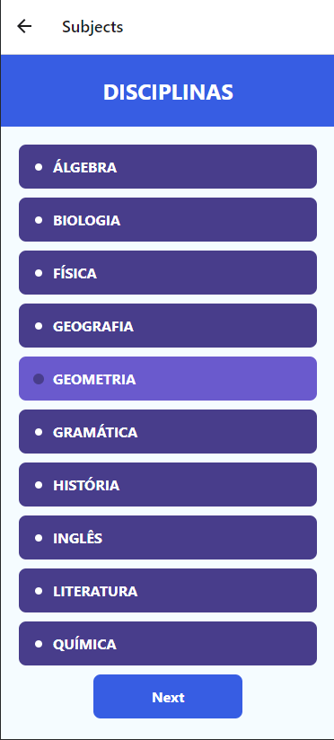

# CC4670_Projeto_2
Projeto 2 da disciplina de Computação Móvel, aplicativo criado usando React Native.
Aluno: Pedro Henrique Silva Reis
RA: 11.120.129-9

# Sistema de Controle de Presença de Alunos

## Introdução

Este projeto é uma aplicação de controle de presença de alunos desenvolvida em React Native, que permite aos professores registrar a presença dos alunos em diferentes disciplinas de forma eficiente e rápida. O objetivo principal é facilitar a gestão da presença dos alunos e proporcionar um método prático para armazenar e acessar esses dados. O projeto utiliza o Firebase para armazenar as informações de presença e disciplinas, garantindo que os dados sejam acessíveis de qualquer lugar.

## Motivação

A motivação para desenvolver este aplicativo surgiu da necessidade de uma ferramenta moderna e eficiente para gerenciar a presença dos alunos nas aulas ministradas pelo Cursinho FEI, uma equipe de alunos da FEI que lecionam conteúdos de vestibular para alunos carentes da região de São Bernardo do Campo. Métodos tradicionais de controle de presença, como listas em papel, podem ser demorados, propensos a erros e difíceis de organizar. Com o avanço da tecnologia móvel, surgiu a oportunidade de criar uma solução digital que simplificasse este processo, tornando-o mais preciso e acessível.

## Objetivo

O objetivo deste aplicativo é fornecer uma solução prática e eficiente para os monitores do Cursinho registrarem e gerenciarem a presença dos alunos. Com a digitalização deste processo, espera-se reduzir o tempo gasto em tarefas administrativas e aumentar a precisão dos registros, além de facilitar o acesso e a análise dos dados de presença.

## Funcionalidades

- **Menu Principal:**
  - Acesso rápido às funcionalidades principais: registrar presença, visualizar horário e acessar o Drive.

- **Seleção de Disciplinas:**
  - Lista todas as disciplinas disponíveis.
  - Permite que o usuário selecione uma disciplina para registrar a presença.

- **Registro de Presença:**
  - Exibe a lista de alunos.
  - Permite que o usuário marque os alunos presentes e salve a lista de presença juntamente com a disciplina selecionada.
  - Exibe uma notificação e vibra o dispositivo para confirmar a ação de salvar.

- **Armazenamento no Firebase:**
  - Salva os dados de presença e disciplinas no Firebase em tempo real, garantindo acesso remoto e seguro.

## Capturas de Tela

### Menu Principal

### Seleção de Disciplinas

### Registro de Presença

## Tecnologias Utilizadas

- [React Native](https://reactnative.dev/): Framework para desenvolvimento de aplicativos móveis multiplataforma.
- [Firebase](https://firebase.google.com/): Plataforma de desenvolvimento de aplicativos móveis e web que fornece serviços de backend como banco de dados em tempo real.
- [React Navigation](https://reactnavigation.org/): Biblioteca para roteamento e navegação em aplicativos React Native.
- [Toast](https://github.com/calintamas/react-native-toast-message): Biblioteca para exibir mensagens de notificação (toasts) no aplicativo.
- [Expo](https://expo.dev/): Plataforma para desenvolvimento de aplicativos React Native que facilita a configuração e desenvolvimento.

## Uso

O aplicativo de controle de presença possui uma interface simples e intuitiva, dividida em três telas principais:

1. **Tela de Menu (Menu.js):**
   - Apresenta três botões: "PRESENÇA", "HORÁRIO" e "DRIVE".
   - O botão "PRESENÇA" leva à tela de seleção de disciplinas.
   - O botão "HORÁRIO" leva à tela de visualização do horário das aulas.
   - O botão "DRIVE" abre um link externo.

2. **Tela de Seleção de Disciplinas (Subjects.js):**
   - Lista todas as disciplinas disponíveis.
   - O usuário seleciona uma disciplina e navega para a tela de registro de presença.

3. **Tela de Registro de Presença (Students.js):**
   - Exibe a lista de alunos.
   - O usuário pode marcar os alunos presentes e salvar a lista de presença juntamente com a disciplina selecionada.
   - Quando a lista é salva, uma notificação é exibida e o dispositivo vibra para confirmar a ação.

## Estrutura do Projeto

### Descrição dos Arquivos Principais

- **assets/**: Contém arquivos de mídia, como imagens e ícones utilizados na aplicação.
- **components/**: Contém componentes reutilizáveis do React que podem ser utilizados em diferentes partes do aplicativo.
- **screens/**:
  - **Menu.js**: Tela inicial que apresenta o menu principal do aplicativo.
  - **Subjects.js**: Tela para seleção de disciplinas, onde o usuário escolhe a disciplina para a qual deseja registrar a presença.
  - **Students.js**: Tela de registro de presença, onde o usuário marca os alunos presentes e salva as informações.
- **config.js**: Arquivo de configuração do Firebase, onde as credenciais e configurações do Firebase são definidas.
- **App.js**: Arquivo principal da aplicação que configura a navegação e renderiza as telas principais.
- **package.json**: Arquivo que define as dependências do projeto e scripts para gerenciamento do npm.
